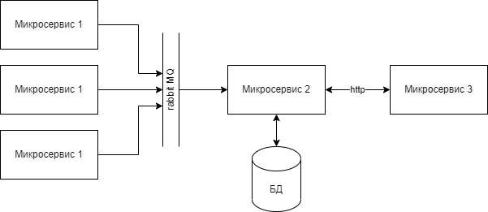

# Система микросервисов на Java

## Описание

Проект представляет собой систему, состоящую из трех микросервисов, разработанных на языке Java
с использованием Spring Boot, Hibernate, PostgreSQL, RabbitMQ, а также библиотек MapStruct и Feign.

## Архитектура

Система включает в себя три микросервиса:

- **Микросервис 1 (status-app)**: Клиентское приложение, которое периодически отправляет сообщения о своем статусе и
  другую информацию в RabbitMQ.
- **Микросервис 2 (user-data-service)**: Серверное приложение, принимающее сообщения от микросервиса 1, сохраняющее их в
  базе данных и взаимодействующее с микросервисом 3.
- **Микросервис 3 (user-manager-app)**: Клиентское приложение, предоставляющее возможность выполнять операции с
  пользователями и сообщениями через HTTP-запросы.

## База данных

Структура базы данных включает несколько связанных таблиц, которые хранят:

- Информацию о пользователях системы.
- Данные об их последней активности.
- Сообщения от пользователей с временными метками.
- Информацию об активностях сервисов и передаваемые команды.

## Документация OpenAPI

Документация для API системы создана с использованием спецификации OpenAPI.
Документацию можно просмотреть по следующим адресам:

- Микросервис 1 (status-app): http://localhost:9090/swagger-ui/index.html
- Микросервис 2 (user-data-service): http://localhost:8080/swagger-ui/index.html
- Микросервис 3 (user-manager-app): http://localhost:8081/swagger-ui/index.html

## Системные требования и запуск

### Системные требования

- Java 11
- Spring
- RabbitMQ
- PostgreSQL
- Docker

### Запуск

1. Клонируйте репозиторий проекта.
2. Соберите проект с помощью команды:
   `mvn clean install`
3. Запустите приложение с помощью команды:
   `docker-compose up`
4. Импортируйте и запустите коллекцию тестов в Postman из корневой директории ./postman

